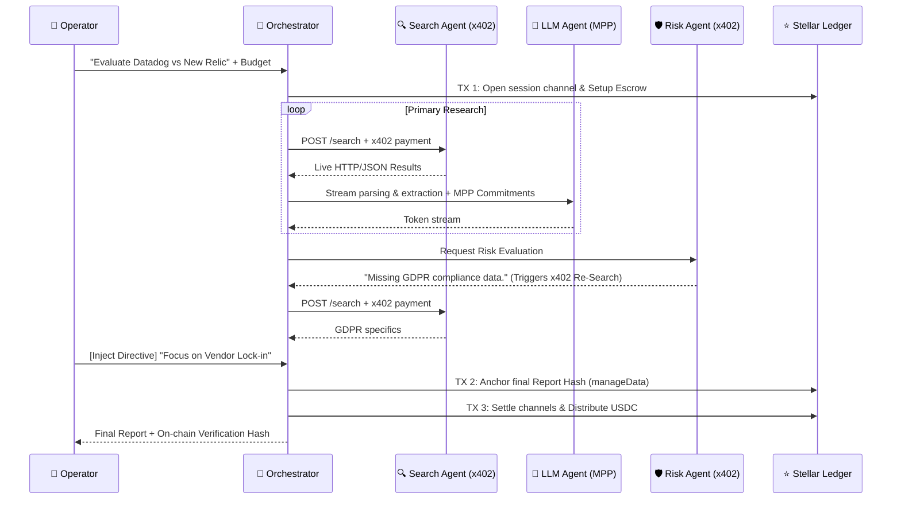
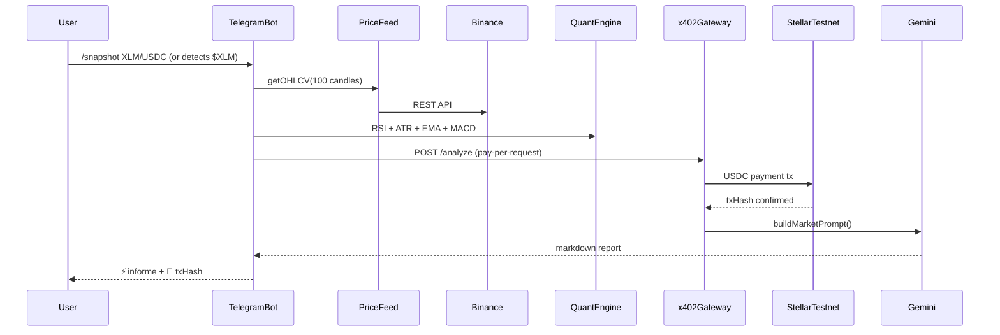

[](./LICENSE)

# Ferrule — Due Diligence Desk for SaaS B2B

> **Autonomous Tech & Risk Evaluation. Paid per report via x402/MPP. Anchored on Stellar.**

**Ferrule uses x402 and MPP Session to enable autonomous agent-to-agent payments on Stellar, with every market analysis request settled as a real on-chain transaction in USDC.**

Ferrule is a next-generation research console designed for CTOs, CISOs, and DevOps leads who need to evaluate B2B software vendors (monitoring, security, logging, payments, etc.) without spending weeks on manual due diligence. 

Instead of generic LLM web-searches that hallucinate facts or suffer from confirmation bias, **Ferrule orchestrates an autonomous network of specialized agents** that cross-examine documentation, uncover vendor lock-in, and assess security risks. 

Every agent action is cryptographically paid for using Stellar micropayments (`x402`), and the final report is immutably anchored on-chain using `manageData` for guaranteed verifiability.

---

## 🏆 The "Why Not ChatGPT?" Factor

Standard basic LLMs fail at high-stakes due diligence:
1. **Hallucinations:** They make up compliance certifications or pricing tiers.
2. **Confirmation Bias:** They tell you what you want to hear, missing hidden technical debt.
3. **Zero Verifiability:** You can't prove *when* the report was generated or *what* data it cited.

### How Ferrule Solves This:
1. **Adversarial Risk Agent:** A dedicated, isolated AI specifically prompted to attack the primary report, find security gaps, and autonomously trigger secondary research (`x402` paid) until satisfied.
2. **Human-in-the-Loop Steering:** Operators can pause the pipeline and inject directives mid-flight.
3. **On-Chain Immutable Outcomes:** Every report hash is anchored to the Stellar ledger (`manageData`), proving cryptographically to stakeholders that the due diligence was performed at a specific point in time, free of tampering.

---

## ⚙️ Architecture & Data Flow

### 1. The Due Diligence Swarm


### 2. Quantitative Market Monitor (Perpetual Telegram Agent)
Ferrule features a fully autonomous quantitative agent accessible via Telegram. The Telegram module uses stateless, timestamped **HMAC SHA-256 verification** to link Web Console wallets to Telegram IDs without requiring a centralized SQL database.

The user can ask the bot to analyze tokens (e.g., "$XLM") or manage perpetual monitors. It natively detects `$TICKER` mentions and parses Native XLM/USDC token pools.


#### Live Telegram Output
```text
📊 Ferrule Market — XLM/USDC
📅 Thu, 09 Apr 2026 22:00:44 GMT

💲 Price: $0.1565 | -1.51% 24h

📈 INDICATORS
• RSI (14): 55.7 ⚪ neutral
• EMA 9/21: $0.1558 / $0.1560 (📉 bearish)
• MACD: Hist 0.00 (📈 bullish momentum accelerating)
• OBV: ⚠️ bearish volume divergence
• ADX (14): 32.3 (💪 strong trend)
• ATR (14): $0.0014 → volatility 0.91%
• Support: $0.1526
• Resistance: $0.1575
• Fibs 38.2%: $0.16 | 61.8%: $0.16

💡 AI ANALYSIS: 
🎯 Directional Bias: SHORT 85% confidence
📍 Optimal Entry: $0.1570
🛑 Stop Loss: $0.1591
🎯 Take Profit:
    *   R/R 1:2: $0.1528
    *   R/R 1:3: $0.1507
💡 Key Confluences:
*   *Price at strong resistance ($0.1575) which also coincides with the Fib 38.2% level.*
*   *Clear bearish EMA 9/21 crossover, indicating short-term downside pressure.*
*   *Strong bearish volume divergence (OBV), suggesting smart money distribution despite current price action, outweighing any short-term bullish momentum indicated by MACD.*
*   *ADX(14) at 32.3, confirming a strong trend is in play.*

*Contradictory Signals Discounted:*
*   *MACD Histogram (0.0005, bullish momentum accelerating):* This signal is discounted. While indicating accelerating momentum, MACD is a lagging indicator. The more immediate and critical signals are the bearish EMA crossover and, more importantly, the strong bearish OBV divergence, which suggests underlying selling pressure despite minor price upticks. This MACD acceleration could represent a minor bounce within a broader bearish structure or a 'dead cat bounce' against strong resistance.
*   *RSI(14) (55.7, neutral):* This signal is considered secondary. While slightly above neutral, it lacks conviction for a strong bullish move. The robust bearish OBV divergence and price action at resistance provide a much stronger counter-narrative, indicating that any perceived strength is likely unsustainable or artificial.
```

---

## 🛡️ AP2 Risk Mandates (On-Chain Policy Enforcement)

Ferrule implements **AP2-style mandates** on Stellar — the user defines spending policies and source restrictions *before* agents execute. These rules are anchored on-chain via a dedicated `RiskMandates` Soroban contract, and the Orchestrator enforces them in real-time.

| Mandate Rule | Enforcement | On Violation |
|---|---|---|
| **Max Budget (USDC)** | Checked before every x402 payment and MPP commitment | `MANDATE_BLOCKED: budget_exceeded` event emitted, payment skipped |
| **Allowed Domains** | Source domain checked against mandate whitelist | `MANDATE_BLOCKED: domain_not_allowed` event emitted with specific domain |

The user controls mandates through abstract checkboxes in the Mission UI (e.g., "Official Docs", "GitHub", "Security DBs"), which internally map to real domain patterns written to Soroban as CSV strings.

**Contract:** `contracts/risk-mandates/src/lib.rs`  
**Verified Build Hash:** [`3ca8360df3d87e1bd00defb076f81590ed96904e8fe0d53712345055bad0c0c2`](https://stellar.expert/explorer/testnet/contract/CAN7Z2DSHSKHH54QMX33SKSRURHVNSKDE62ANSBH55WH43MEJ5BRO3IC)

---

## 📊 On-Chain Agent Reputation & SLA

Each agent registered in the `agent-registry` Soroban contract now tracks verifiable mission outcomes:

- `total_missions` — incremented after every mission
- `successful_missions` — incremented only on full success (no mandate blocks)
- `success_rate` = `successful_missions / total_missions`

The Orchestrator calls `record_mission(agent_id, success)` as a **real Soroban TX** at the end of every mission — including when a mission is partially blocked by mandate enforcement (`success = false`).

This creates a **trustless, on-chain reputation layer** for autonomous agents — something not currently implemented in any Soroban project for this use case.

**Contract:** `contracts/agent-registry/src/lib.rs`  
**Verified Build Hash:** [`d891bd511d46ea04ef0b1218ef70095a19c5b3c2b6147c421bef765f33c76bba`](https://stellar.expert/explorer/testnet/contract/CBFO7Y74GBX5C5CVBVGXAX5LG4GSVK44OSKZNOZCMOTZXKA7WGROYLH2)

---

## 💎 Stellar Native Economics
Ferrule demonstrates the absolute necessity of a high-speed, low-cost network like Stellar.

| Feature | Execution | Economic Benefit |
|---------|-----------|------------------|
| **Pay-per-query (x402)** | Search Agent requests paid instantly per HTTP call. | Agent-to-Agent programmatic commerce without subscriptions. |
| **Streaming compute (MPP)** | LLM Agent paid per 100-tokens via `ed25519` commits. | Zero counterparty risk; compute equals cash stream. |
| **On-Chain Anchoring** | `manageData` operation on Platform Wallet. | Immutable, verifiable proof-of-diligence for compliance teams. |
| **Public Agent Registry** | `agent-registry` Soroban contract with SLA tracking. | Ferrule's agents are public x402 services with verifiable on-chain reputation. |
| **AP2 Mandates** | `risk-mandates` Soroban contract. | Users define spend/source policies on-chain; agents are cryptographically bound to obey them. |

---

## 📋 Technical Implementation Notes

For complete transparency regarding the current state of the prototype, please note the following implementation details, API usage, and fallback mechanisms:

1. **Network Configuration**: The application is fully deployed and configured to run on the **Stellar Testnet**. Synthetic Testnet USDC is minted and utilized for all agent payments.
2. **Search Agent Engine**: We migrated from an unreliable web-scraped SearXNG instance to the **Tavily API** to ensure maximum reliability and deterministic JSON extraction during the hackathon demo. It rigorously enforces the domains passed by our Soroban Contracts.
3. **Generative AI Resiliency**: We utilize **Google Gemini 2.5 Flash** due to its expansive context window. To avoid Hackathon free-tier rate limits (429 errors / TPM exhaustion), we engineered a **Multi-Key Round Robin Pool** that intercepts 503s/429s and seamlessly rotates API Keys mid-stream without crashing the orchestrator.
4. **Market Data (Mocked Fallbacks)**: For the Telegram quantitative agent, OHLCV data is fetched live from the Binance REST API. However, due to liquidity limitations on specific Testnet pairs, requests for minor tokens or low-liquidity USDC pairs silently fallback to cross-evaluating their respective high-liquidity USDT pair under the hood to ensure the mathematical indicators (fibonacci, MACD) do not throw `NaN` exceptions during the demo.
5. **No Central Database**: Ferrule intentionally utilizes purely stateless infrastructure. Wallets are authenticated via HMAC SHA-256 signatures injected directly into deep links from the web, removing the need for password registries. 

---

## 🚀 Running Locally

1. Install dependencies:
   ```bash
   npm install
   ```
2. Configure `.env`:
   Copy `apps/backend/.env.example` to `apps/backend/.env` and `apps/frontend/.env.local`. Provide your Gemini API key and Testnet funded Stellar secret keys for:
   - `STELLAR_SECRET_KEY` (Platform Wallet)
   - `STELLAR_SECRET_KEY_2` (Platform Wallet 2 / Hashing)
   - `RISK_AGENT_SECRET` (Risk Agent autonomous funder)
   
3. Start the Backend API & Websockets:
   ```bash
   npm run dev:backend
   ```
4. Start the Frontend Console:
   ```bash
   npm run dev:frontend
   ```
5. Navigate to `http://localhost:3000` and deploy your first Due Diligence mission!

---

## 🔮 After the Hackathon

These features are designed and ready to integrate as natural extensions of the existing architecture:

| Feature | Description | Status |
|---------|-------------|--------|
| **Vault DeFi Budget Pools** | Integrate DeFindex-style vaults so enterprise teams deposit USDC into a shared pool; agents draw from it per-mission with mandate limits. | Designed |
| **Vendor Subsidy Model** | SaaS vendors can subsidize due diligence reports about their own products by staking USDC — incentivizing transparency. | Designed |
| **Multi-Rail (USDC + Fiat)** | Stripe integration for fiat on-ramp, enabling non-crypto teams to fund missions via credit card while agents transact in USDC. | Planned |
| **Cross-Chain Agent Discovery** | Extend Agent Registry to support agents on other chains (Monad, Ethereum L2s) while keeping settlement on Stellar. | Exploratory |

---
*Built for the Stellar Meridian Hackathon 2026. Empowering autonomous institutional commerce.*
