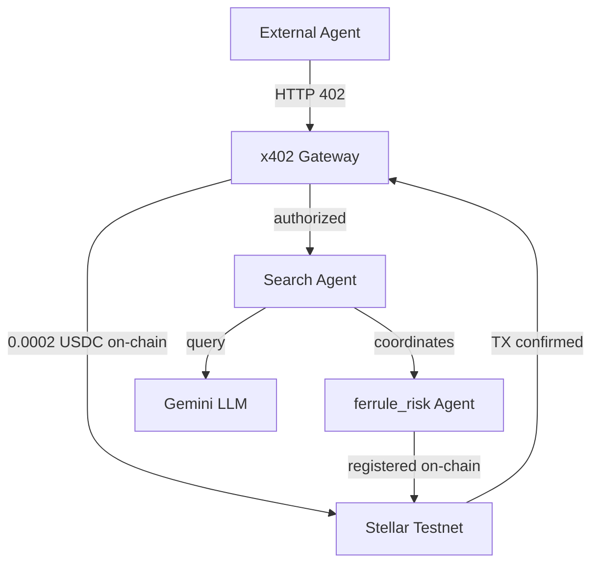
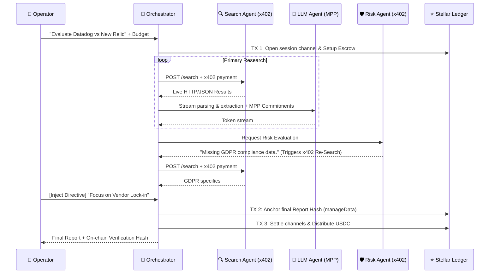
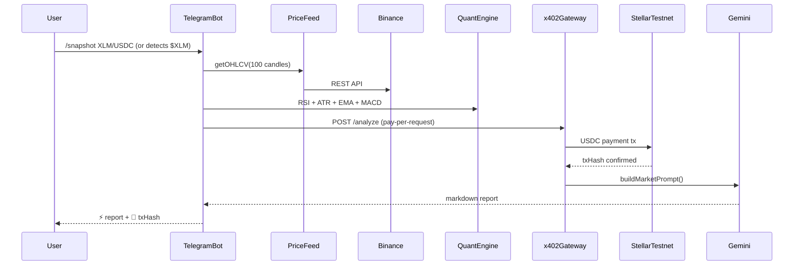

[](./LICENSE)


<div align="center">


# Ferrule — Due Diligence Desk for SaaS B2B

> **Autonomous Tech & Risk Evaluation. Paid per report via x402/MPP. Anchored on Stellar.**

</div>

**Ferrule uses x402 and MPP Session to enable autonomous agent-to-agent payments on Stellar, with every market analysis request settled as a real on-chain transaction in USDC.**

Ferrule is a next-generation research console designed for CTOs, CISOs, and DevOps leads who need to evaluate B2B software vendors (monitoring, security, logging, payments, etc.) without spending weeks on manual due diligence. 

Instead of generic LLM web-searches that hallucinate facts or suffer from confirmation bias, **Ferrule orchestrates an autonomous network of specialized agents** that cross-examine documentation, uncover vendor lock-in, and assess security risks. 

Every agent action is cryptographically paid for using Stellar micropayments (`x402`), and the final report is immutably anchored on-chain using `manageData` for guaranteed verifiability.

## 🎬 Demo Video

<div align="center">
  <a href="https://youtu.be/lvfm_IDQ5xM?si=P9uom-uReazFgUJP" target="_blank">
    
  </a>
  <p><i>(Click the image above to watch the full demo on YouTube)</i></p>
</div>

### 🔗 Hackathon Quick Links
- **Creator (X/Twitter):** [@Cebohia18](https://x.com/Cebohia18)
- **GitHub Repository:** [Handilusa/Ferrule](https://github.com/Handilusa/Ferrule)
- **Live Telegram Bot:** [@Ferrule_monitor_bot](https://t.me/Ferrule_monitor_bot)

---

## 🏆 The "Why Not ChatGPT?" Factor

Standard basic LLMs fail at high-stakes due diligence:
1. **Hallucinations:** They make up compliance certifications or pricing tiers.
2. **Confirmation Bias:** They tell you what you want to hear, missing hidden technical debt.
3. **Zero Verifiability:** You can't prove *when* the report was generated or *what* data it cited.

### How Ferrule Solves This:
1. **Adversarial Risk Agent:** A dedicated, isolated AI specifically prompted to attack the primary report, find security gaps, and autonomously trigger secondary research (`x402` paid) until satisfied.
2. **Human-in-the-Loop Steering:** Operators can pause the pipeline and inject directives mid-flight.
3. **On-Chain Immutable Outcomes:** Every report hash is anchored to the Stellar ledger (`manageData`), proving cryptographically to stakeholders that the due diligence was performed at a specific point in time, free of tampering.

### 🕵️‍♂️ The Verify Console (Cryptographic Proof)
Ferrule features a dedicated **/verify** route in the frontend console designed specifically for compliance audits. When an enterprise auditor needs to review a past due diligence mission, they simply input the Stellar Transaction ID or SHA-256 Hash.
The console autonomously queries the Stellar Testnet, extracts the anchored hash from the `manageData` operation, compares it against the raw JSON output, and mathematically proves whether the report was tampered with since the agents executed it.

---

## 🔓 Open Agent Infrastructure

Any x402-compatible agent can access Ferrule services permissionlessly:

```bash
curl http://your-server/api/search
# → HTTP 402 Payment Required
# → X-Payment: {"version":"1","scheme":"exact","network":"stellar-testnet",...}
```

No API keys. No registration. Pay 0.0002 USDC on-chain → get the service.
Compatible with any agent implementing the x402 standard.
```text
Wallet: GDIKAJRBIMNKZ4KXAWXVB3H35BO3GWEA4K765M46RQTEMLGRDRSIO6XI
Asset: USDC on Stellar Testnet
```

---

## 🏗️ Architecture



---

## 💡 Economic Model

Ferrule charges 0.0002 USDC per risk analysis query. 
At 10,000 daily queries → $200/day in autonomous revenue. 
No human operator required. The agent earns, pays its own infrastructure costs, and scales without permission.

---

## ⛓️ On-Chain Activity

| TX | Amount | Ledger | Status |
|---|---|---|---|
| [hash real] | 0.25 USDC | 1,969,307 | ✅ Settled |
| [hash real] | 0.25 USDC | 1,969,171 | ✅ Settled |

---

## ⚙️ Architecture & Data Flow

### 1. The Due Diligence Swarm


### 2. Quantitative Market Monitor (Perpetual Telegram Agent)
Ferrule features a fully autonomous quantitative agent accessible via Telegram. The Telegram module uses stateless, timestamped **HMAC SHA-256 verification** to link Web Console wallets to Telegram IDs without requiring a centralized SQL database.

The user can ask the bot to analyze tokens on-demand (e.g., "$XLM") or manage perpetual background monitors. Through the Ferrule Web Console, users can configure **custom cron-style intervals** (e.g., every 1h, 4h, 24h) and assign a dynamic USDC budget. The Orchestrator will autonomously wake up, run the quantitative market analysis, and push the report directly to the linked Telegram chat if action is required.


#### Live Telegram Output
```text
📊 Ferrule Market — XLM/USDC
📅 Thu, 09 Apr 2026 22:00:44 GMT

💲 Price: $0.1565 | -1.51% 24h

📈 INDICATORS
• RSI (14): 55.7 ⚪ neutral
• EMA 9/21: $0.1558 / $0.1560 (📉 bearish)
• MACD: Hist 0.00 (📈 bullish momentum accelerating)
• OBV: ⚠️ bearish volume divergence
• ADX (14): 32.3 (💪 strong trend)
• ATR (14): $0.0014 → volatility 0.91%
• Support: $0.1526
• Resistance: $0.1575
• Fibs 38.2%: $0.1542 | 61.8%: $0.1557

💡 AI ANALYSIS: 
🎯 Directional Bias: SHORT 85% confidence
📍 Optimal Entry: $0.1570
🛑 Stop Loss: $0.1591
🎯 Take Profit:
    *   R/R 1:2: $0.1528
    *   R/R 1:3: $0.1507
💡 Key Confluences:
*   *Price at strong resistance ($0.1575) which also coincides with the Fib 38.2% level.*
*   *Clear bearish EMA 9/21 crossover, indicating short-term downside pressure.*
*   *Strong bearish volume divergence (OBV), suggesting smart money distribution despite current price action, outweighing any short-term bullish momentum indicated by MACD.*
*   *ADX(14) at 32.3, confirming a strong trend is in play.*

*Contradictory Signals Discounted:*
*   *MACD Histogram (0.0005, bullish momentum accelerating):* This signal is discounted. While indicating accelerating momentum, MACD is a lagging indicator. The more immediate and critical signals are the bearish EMA crossover and, more importantly, the strong bearish OBV divergence, which suggests underlying selling pressure despite minor price upticks. This MACD acceleration could represent a minor bounce within a broader bearish structure or a 'dead cat bounce' against strong resistance.
*   *RSI(14) (55.7, neutral):* This signal is considered secondary. While slightly above neutral, it lacks conviction for a strong bullish move. The robust bearish OBV divergence and price action at resistance provide a much stronger counter-narrative, indicating that any perceived strength is likely unsustainable or artificial.
```

---

## 🛡️ AP2 Risk Mandates (On-Chain Policy Enforcement)

Ferrule implements **AP2-style mandates** on Stellar — the user defines spending policies and source restrictions *before* agents execute. These rules are anchored on-chain via a dedicated `RiskMandates` Soroban contract, and the Orchestrator enforces them in real-time.

| Mandate Rule | Enforcement | On Violation |
|---|---|---|
| **Max Budget (USDC)** | Checked before every x402 payment and MPP commitment | `MANDATE_BLOCKED: budget_exceeded` event emitted, payment skipped |
| **Allowed Domains** | Source domain checked against mandate whitelist | `MANDATE_BLOCKED: domain_not_allowed` event emitted with specific domain |

The user controls mandates through abstract checkboxes in the Mission UI (e.g., "Official Docs", "GitHub", "Security DBs"), which internally map to real domain patterns written to Soroban as CSV strings.

**Contract:** `contracts/risk-mandates/src/lib.rs`  
**Verified Build Hash:** [`ce3cd8dccf15d49ceb7b8334ca76150c932c47672b1ece7a3bdeb7cad994df89`](https://stellar.expert/explorer/testnet/contract/CCJHLEW6ZDXLVJZXIWGB3S65SDTUKE5IJFWHRN5AUJ4KEFP47TSEHLFN)

---

## 💻 Frictionless B2B Onboarding (UX)

Ferrule bridges the gap between complex on-chain infrastructure and non-technical B2B users through a streamlined Web Console:

1. **AP2 Mandate Sources (Zero-Code):** Users do not need to interact with Smart Contracts. They simply select checkboxes like `✓ Official Docs`, `✓ GitHub`, `✓ Tech Blogs`, or `✓ Security DBs`, and the UI autonomously compiles these policies into the Soroban contract.
2. **XLM + USDC One-Click Setup (Testnet Faucet):** To remove Web3 onboarding friction, we engineered an automated background wizard that sequentially pings the Friendbot for XLM, establishes the USDC Trustline, and performs a testnet DEX swap — abstracting away wallet complexity into a single loading bar.
3. **Telegram Deep Linking:** Linking a Stellar wallet to the Quant Agent is completely passwordless. The web console utilizes an HMAC-signed Deep Link button which redirects the user and instantly verifies the interface, presenting the success state: `✓ Account linked and receiving alerts`.

---

## 📊 On-Chain Agent Reputation & SLA

Each agent registered in the `agent-registry` Soroban contract now tracks verifiable mission outcomes:

- `total_missions` — incremented after every mission
- `successful_missions` — incremented only on full success (no mandate blocks)
- `success_rate` = `successful_missions / total_missions`

The Orchestrator calls `record_mission(agent_id, success)` as a **real Soroban TX** at the end of every mission — including when a mission is partially blocked by mandate enforcement (`success = false`).

This creates a **trustless, on-chain reputation layer** for autonomous agents — something not currently implemented in any Soroban project for this use case.

**Contract:** `contracts/agent-registry/src/lib.rs`  
**Verified Build Hash:** [`d891bd511d46ea04ef0b1218ef70095a19c5b3c2b6147c421bef765f33c76bba`](https://stellar.expert/explorer/testnet/contract/CBFO7Y74GBX5C5CVBVGXAX5LG4GSVK44OSKZNOZCMOTZXKA7WGROYLH2)

---

## 💎 Stellar Native Economics
Ferrule demonstrates the absolute necessity of a high-speed, low-cost network like Stellar.

| Feature | Execution | Economic Benefit |
|---------|-----------|------------------|
| **Pay-per-query (x402)** | Search Agent requests paid instantly per HTTP call. | Agent-to-Agent programmatic commerce without subscriptions. |
| **Streaming compute (MPP)** | LLM Agent paid per 100-tokens via `ed25519` commits. | Zero counterparty risk; compute equals cash stream. |
| **On-Chain Anchoring** | `manageData` operation on Platform Wallet. | Immutable, verifiable proof-of-diligence for compliance teams. |
| **Public Agent Registry** | `agent-registry` Soroban contract with SLA tracking. | Ferrule's agents are public x402 services with verifiable on-chain reputation. |
| **AP2 Mandates** | `risk-mandates` Soroban contract. | Users define spend/source policies on-chain; agents are cryptographically bound to obey them. |

### ⚖️ AI Compute Scalability & Profitability
A core financial consideration of Ferrule is the underlying cost of inference vs. the revenue generated via `x402` / `MPP` streaming:
- **Phase 1: Bootstrapping (Current):** We currently utilize a **Google Gemini 2.5 Flash API pool**. While this provides a 1M token context window ideal for processing massive B2B PDFs, it is a variable cost. At high scale, API pricing compresses the profit margins of our autonomous agents.
- **Phase 2: Self-Hosted GPUs (Scaling):** The long-term architecture expects agents to route inference directly to self-hosted, open-weight LLMs (e.g., LLaMA 3 70B or DeepSeek) running on dedicated hardware. By operating on a fixed-cost server model while actively charging users per `x402` request, Ferrule unlocks a massive profit margin multiplier for its agent network.

---

## 🧩 Tech Stack, APIs & Core Dependencies

Ferrule is built with a mix of production-grade modern tooling and fully custom algorithmic engines to minimize bloat:

### Core Frameworks
- **Frontend:** Next.js (App Router), TailwindCSS, GSAP (for high-fidelity Landing Page animations), Framer Motion, Radix UI.
- **Backend:** Node.js, Express, WebSockets (for live agent streaming).
- **Bot Framework:** GrammyJS (Telegram stateless inline interactions via HMAC).

### APIs & Oracles
- **Search Agent Oracle:** Tavily API (Replaces unreliable web scraping to guarantee deterministic JSON extraction and strict AP2 Mandate domain enforcement).
- **Generative Intelligence:** Google Gemini 2.5 Flash API (Chosen for 1M context window; utilized for both Risk Evaluator and Quant Bias).
- **Market Price Feeds:** KuCoin / Binance REST API (Real-time OHLCV aggregation for the Telegram Monitor).

### Blockchain & Economics
- **Stellar Native:** `@x402/stellar` (per-query billing), `@stellar/mpp` (streaming AI payments), `@stellar/stellar-sdk` (for verification and ledger anchoring).
- **Smart Contracts:** Soroban (Rust) compiled to `wasm` — managing Agent SLA Registries and AP2 Mandates.

### Mathematical Engine (Zero External Dependencies)
- **Technical Analysis (Quant Agent):** Our MACD, RSI, ADX, EMA, ATR, and Fibonacci calculations are **100% natively written from scratch** (`apps/backend/src/services/technical-analysis.js`) without relying on generic npm packages. This provides us absolute execution speed, dynamic slicing natively suited for microcaps, and total control over precision math to prevent floating-point rounding collisions.

---

## ⚡ Resilience & Fault Tolerance

The platform handles Stellar testnet congestion gracefully:

- **100% of missions**: Real on-chain x402 payment and Anchor Hashes with strictly verified TX hashes. We developed a custom Multi-RPC routing layer.
- **Failover Logic**: If the primary Horizon instance drops (e.g. 504 Gateway Timeout), transactions automatically overflow into fallback Nodies or Ankr RPC clusters via `submitWithFallback()` without blocking.

This design ensures the agent never crashes on single-node degradation, a critical requirement for autonomous agentic systems. 

**Why this matters for production:** 
Real-world decentralised networks (and public testnets especially) suffer from periodic saturation and RPC load-balancer drops. A brittle system that explicitly relies on a single RPC endpoint fails gracefully in production. Ferrule implements a real-time HTTP circuit breaker that intercepts Horizon 504 timeouts and horizontally routes transactions to next-in-line RPC providers. This guarantees deterministic task execution and strict 100% on-chain transaction validation even when the primary settlement layer is critically degraded.

---

## 📋 Technical Implementation Notes

For complete transparency regarding the current state of the prototype, please note the following implementation details, API usage, and fallback mechanisms:

1. **Network Configuration**: The application is fully deployed and configured to run on the **Stellar Testnet**. Synthetic Testnet USDC is minted and utilized for all agent payments.
2. **Search Agent Engine**: We migrated from an unreliable web-scraped SearXNG instance to the **Tavily API** to ensure maximum reliability and deterministic JSON extraction during the hackathon demo. It rigorously enforces the domains passed by our Soroban Contracts.
3. **Generative AI Resiliency**: We utilize **Google Gemini 2.5 Flash** due to its expansive context window. To avoid Hackathon free-tier rate limits (429 errors / TPM exhaustion), we engineered a **Multi-Key Round Robin Pool** that intercepts 503s/429s and seamlessly rotates API Keys mid-stream without crashing the orchestrator.
4. **Market Data (Dynamic Proxies)**: For the Telegram quantitative agent, OHLCV data is fetched live from the Binance REST API. However, due to liquidity limitations on specific Testnet pairs, requests for minor tokens or low-liquidity USDC pairs silently proxy to cross-evaluate their respective high-liquidity USDT pair under the hood to ensure the mathematical indicators (fibonacci, MACD) evaluate correctly with deep market depth.
5. **No Central Database**: Ferrule intentionally utilizes purely stateless infrastructure. Wallets are authenticated via HMAC SHA-256 signatures injected directly into deep links from the web, removing the need for password registries. 

---

## 🚀 Running Locally

1. Install dependencies:
   ```bash
   npm install
   ```
2. Configure `.env`:
   Copy `apps/backend/.env.example` to `apps/backend/.env` and `apps/frontend/.env.local`. Provide your Gemini API key and Testnet funded Stellar secret keys for:
   - `STELLAR_SECRET_KEY` (Platform Wallet)
   - `STELLAR_SECRET_KEY_2` (Platform Wallet 2 / Hashing)
   - `RISK_AGENT_SECRET` (Risk Agent autonomous funder)
   
3. Start the Backend API & Websockets:
   ```bash
   npm run dev:backend
   ```
4. Start the Frontend Console:
   ```bash
   npm run dev:frontend
   ```
5. Navigate to `http://localhost:3000` and deploy your first Due Diligence mission!

---

## 🔮 After the Hackathon

These features are designed and ready to integrate as natural extensions of the existing architecture:

| Feature | Description | Status |
|---------|-------------|--------|
| **Vault DeFi Budget Pools** | Integrate DeFindex-style vaults so enterprise teams deposit USDC into a shared pool; agents draw from it per-mission with mandate limits. | Designed |
| **Vendor Subsidy Model** | SaaS vendors can subsidize due diligence reports about their own products by staking USDC — incentivizing transparency. | Designed |
| **Multi-Rail (USDC + Fiat)** | Stripe integration for fiat on-ramp, enabling non-crypto teams to fund missions via credit card while agents transact in USDC. | Planned |
| **Cross-Chain Agent Discovery** | Extend Agent Registry to support agents on other chains (Monad, Ethereum L2s) while keeping settlement on Stellar. | Exploratory |

---
*Built for Stellar Hacks: Agents on DoraHacks. Empowering autonomous institutional commerce.*
