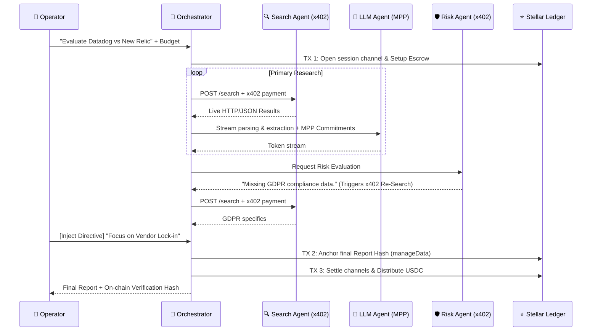

# Ferrule — Due Diligence Desk for SaaS B2B

> **Autonomous Tech & Risk Evaluation. Paid per report via x402/MPP. Anchored on Stellar.**

Ferrule is a next-generation research console designed for CTOs, CISOs, and DevOps leads who need to evaluate B2B software vendors (monitoring, security, logging, payments, etc.) without spending weeks on manual due diligence. 

Instead of generic LLM web-searches that hallucinate facts or suffer from confirmation bias, **Ferrule orchestrates an autonomous network of specialized agents** that cross-examine documentation, uncover vendor lock-in, and assess security risks. 

Every agent action is cryptographically paid for using Stellar micropayments (`x402`), and the final report is immutably anchored on-chain using `manageData` for guaranteed verifiability.

---

## 🏆 The "Why Not ChatGPT?" Factor

Standard basic LLMs fail at high-stakes due diligence:
1. **Hallucinations:** They make up compliance certifications or pricing tiers.
2. **Confirmation Bias:** They tell you what you want to hear, missing hidden technical debt.
3. **Zero Verifiability:** You can't prove *when* the report was generated or *what* data it cited.

### How Ferrule Solves This:
1. **Adversarial Risk Agent:** A dedicated, isolated AI specifically prompted to attack the primary report, find security gaps, and autonomously trigger secondary research (`x402` paid) until satisfied.
2. **Human-in-the-Loop Steering:** Operators can pause the pipeline and inject directives mid-flight.
3. **On-Chain Immutable Outcomes:** Every report hash is anchored to the Stellar ledger (`manageData`), proving cryptographically to stakeholders that the due diligence was performed at a specific point in time, free of tampering.

## ⚙️ Architecture & Data Flow



## 🛡️ AP2 Risk Mandates (On-Chain Policy Enforcement)

Ferrule implements **AP2-style mandates** on Stellar — the user defines spending policies and source restrictions *before* agents execute. These rules are anchored on-chain via a dedicated `RiskMandates` Soroban contract, and the Orchestrator enforces them in real-time.

| Mandate Rule | Enforcement | On Violation |
|---|---|---|
| **Max Budget (USDC)** | Checked before every x402 payment and MPP commitment | `MANDATE_BLOCKED: budget_exceeded` event emitted, payment skipped |
| **Allowed Domains** | Source domain checked against mandate whitelist | `MANDATE_BLOCKED: domain_not_allowed` event emitted with specific domain |

The user controls mandates through abstract checkboxes in the Mission UI (e.g., "Official Docs", "GitHub", "Security DBs"), which internally map to real domain patterns written to Soroban as CSV strings.

**Contract:** `contracts/risk-mandates/src/lib.rs` — `set_mandate()`, `get_mandate()` via instance storage.

## 📊 On-Chain Agent Reputation & SLA

Each agent registered in the `agent-registry` Soroban contract now tracks verifiable mission outcomes:

- `total_missions` — incremented after every mission
- `successful_missions` — incremented only on full success (no mandate blocks)
- `success_rate` = `successful_missions / total_missions`

The Orchestrator calls `record_mission(agent_id, success)` as a **real Soroban TX** at the end of every mission — including when a mission is partially blocked by mandate enforcement (`success = false`).

This creates a **trustless, on-chain reputation layer** for autonomous agents — something not currently implemented in any Soroban project for this use case.

## 💎 Stellar Native Economics
Ferrule demonstrates the absolute necessity of a high-speed, low-cost network like Stellar.

| Feature | Execution | Economic Benefit |
|---------|-----------|------------------|
| **Pay-per-query (x402)** | Search Agent requests paid instantly per HTTP call. | Agent-to-Agent programmatic commerce without subscriptions. |
| **Streaming compute (MPP)** | LLM Agent paid per 100-tokens via `ed25519` commits. | Zero counterparty risk; compute equals cash stream. |
| **On-Chain Anchoring** | `manageData` operation on Platform Wallet. | Immutable, verifiable proof-of-diligence for compliance teams. |
| **Public Agent Registry** | `agent-registry` Soroban contract with SLA tracking. | Ferrule's agents are public x402 services with verifiable on-chain reputation. |
| **AP2 Mandates** | `risk-mandates` Soroban contract. | Users define spend/source policies on-chain; agents are cryptographically bound to obey them. |

## 🚀 Running Locally

1. Install dependencies:
   ```bash
   npm install
   ```
2. Configure `.env`:
   Copy `apps/backend/.env.example` to `apps/backend/.env` and `apps/frontend/.env.local`. Provide your Gemini API key and Testnet funded Stellar secret keys for:
   - `STELLAR_SECRET_KEY` (Platform Wallet)
   - `STELLAR_SECRET_KEY_2` (Platform Wallet 2 / Hashing)
   - `RISK_AGENT_SECRET` (Risk Agent autonomous funder)
   
3. Start the Backend API & Websockets:
   ```bash
   npm run dev:backend
   ```
4. Start the Frontend Console:
   ```bash
   npm run dev:frontend
   ```
5. Navigate to `http://localhost:3000` and deploy your first Due Diligence mission!

---

## 🔮 After the Hackathon

These features are designed and ready to integrate as natural extensions of the existing architecture:

| Feature | Description | Status |
|---------|-------------|--------|
| **Vault DeFi Budget Pools** | Integrate DeFindex-style vaults so enterprise teams deposit USDC into a shared pool; agents draw from it per-mission with mandate limits. | Designed |
| **Vendor Subsidy Model** | SaaS vendors can subsidize due diligence reports about their own products by staking USDC — incentivizing transparency. | Designed |
| **Multi-Rail (USDC + Fiat)** | Stripe integration for fiat on-ramp, enabling non-crypto teams to fund missions via credit card while agents transact in USDC. | Planned |
| **Cross-Chain Agent Discovery** | Extend Agent Registry to support agents on other chains (Monad, Ethereum L2s) while keeping settlement on Stellar. | Exploratory |

---
*Built for the Stellar Meridian Hackathon.*
