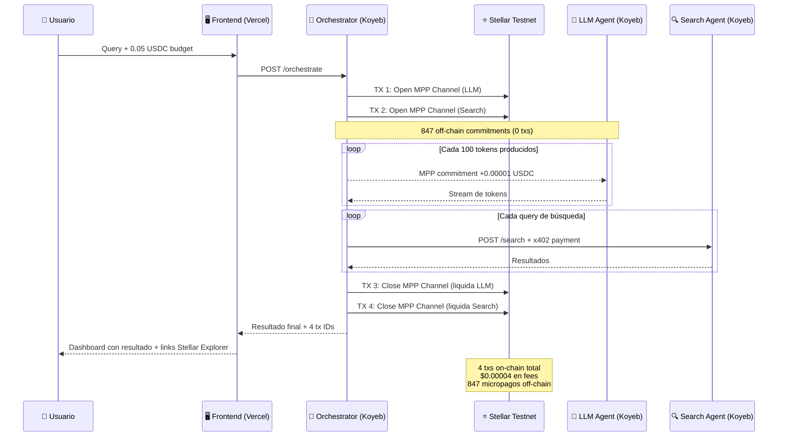

# Meridian — Pay-Per-Token AI Research Agent on Stellar

> 847 micropayments. 2 on-chain transactions. $0.00003 in settlement fees.
> This is only possible on Stellar.

## The Problem
AI agents can't have monthly subscriptions. Pay-per-request (x402) works well for discrete calls but falls completely flat for streaming, continuous computational workloads. There has been no economic primitive for "pay per token produced" off-chain — until the introduction of Stellar MPP Session channels.

## How It Works

## Why Only Stellar

| Feature | Ethereum L1 | Solana | Stellar (MPP + Soroban) |
|---|---|---|---|
| **Pay-Per Token** | Impossible ($15/tx) | Unfeasible ($0.001/tx) | **Native via Session Channels** |
| **Settlement Cost** | Very High | Medium | **~$0.00001 (Microscopic)** |
| **Agent Autonomy** | Smart Contracts | Programs | **Sponsored Accounts + Spending Policies** |
| **Trustless Streaming**| No | No | **ed25519 Off-chain Commitments** |

## Live Demo
Check out our live deployment on Vercel: [Meridian Live Demo](https://meridian.vercel.app/)

## Tech Stack
- **`x402-stellar`**: Pay-per-request model used for our Search Sub-Agent querying the web.
- **`@stellar/mpp`**: Session channels used for our LLM Agent (pay-per-100-tokens generated).
- **Soroban**: The `one-way-channel` and `channel_factory` smart contract architecture for secure channel settlement.
- **Node.js Express + Next.js**: Monolithic Koyeb backend proxying out to Next.js Vercel Edge frontend.
- **Stellar Testnet**: All transactions verifiable natively on `stellar.expert`.

## Live Transactions (Testnet)

These are real, verifiable transactions on the Stellar Testnet produced by the `one-way-channel` Soroban smart contract from [`stellar-experimental`](https://github.com/stellar-experimental/one-way-channel) representing a fully decentralized B2B MPP pipeline:

| Step | TX Hash | Explorer |
|------|---------|----------|
| Channel Open  | 631a3646fb3a629d...448aba5b | [View ↗](https://stellar.expert/explorer/testnet/tx/631a3646fb3a629d44209e22cb1407c7934a94e204591881343cdb33448aba5b) |
| Channel Close | 65f57b933cdff8cc...44acb7a  | [View ↗](https://stellar.expert/explorer/testnet/tx/65f57b933cdff8cc3d1093b618ed77e133c6bc2f0d5d2bfd9fbefae5d44acb7a) |

- **Factory Contract:** `CAL4X2A4QNRUCAZLRBFKCMFGPJEYCFWWQFPPMAOPZFQ3HXDDJQ77ZUME`

## Architecture
Meridian deploys a unified monolithic architecture utilizing `npm workspaces`. A single Node.js backend operates the Orchestrator, LLM Agent, and Search Agent seamlessly on Koyeb to conserve cloud costs (Scale-to-zero) while functioning indistinguishably from microservices through strict `localhost` REST/WebSocket calls.
We intercept LLM chunks via Gemini Flash-Lite and transmit verified `ed25519` micropayment signatures strictly over WebSockets. Once testing concludes, the on-chain transactions hit Soroban.

## Running Locally
1. `npm install` inside the root repository.
2. Ensure you have your `apps/frontend/.env.local` populated with valid Stellar Secret Keys and a `GEMINI_API_KEY`.
3. Start the backend: `cd apps/backend && npm run dev`
4. Start the frontend: `cd apps/frontend && npm run dev`
5. Navigate to `http://localhost:3001` and submit a research query!

## License
MIT
